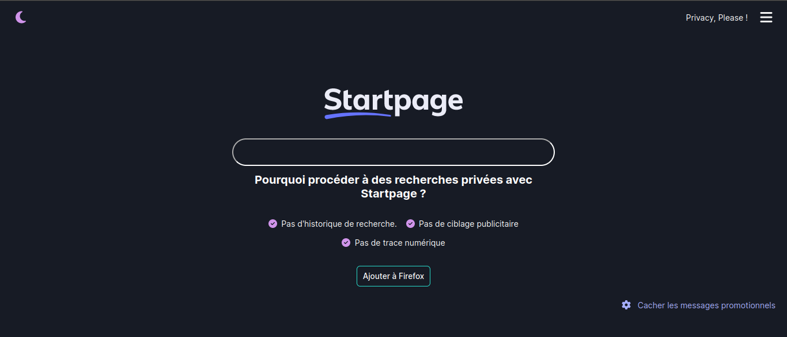

# La Capsule, projet n°1 : Styled Components

Ce projet [Next.js](https://nextjs.org/) est basé sur le template de la commande [`create-next-app`](https://github.com/vercel/next.js/tree/canary/packages/create-next-app).

Il utilise [next/font](https://nextjs.org/docs/basic-features/font-optimization) pour automatiquement optimiser et charger la police **Inter**, une police de Google Font.

Objectif: Manipuler les Styled Components et les thèmes, et faire un clone du moteur de recherche [Startpage](https://www.startpage.com/).
## Authors

- [@Mar-Nb](https://www.github.com/Mar-Nb)

## Screenshots

## Technologies utilisées

**Client:** Next.js 13, Styled Components, Typescript

## Fonctionnalités

- Thème light/dark
- Redirection de recherche vers Google

## Demo

Le projet est déployé sur Vercel à l'adresse suivante : <https://theming-nextjs-lacapsule.vercel.app>
